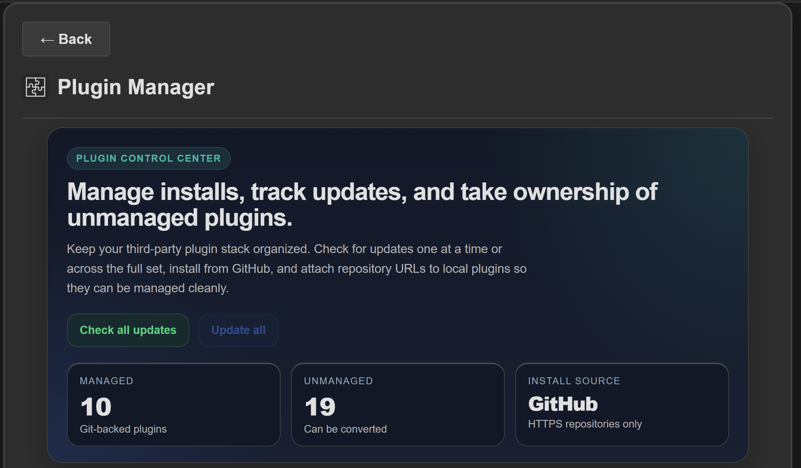
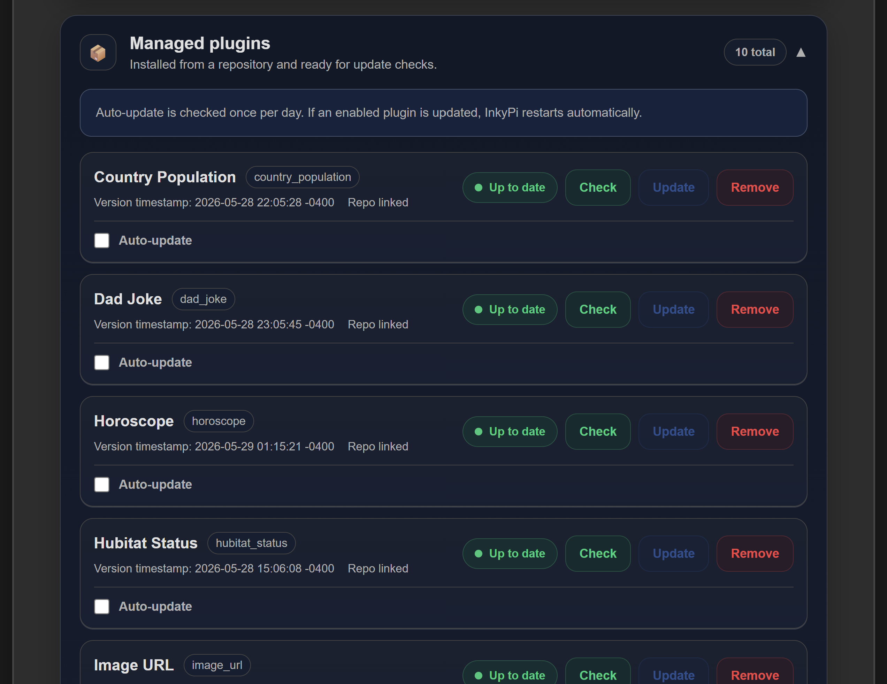

# InkyPi-Plugin-PluginManager





_InkyPi-Plugin-PluginManager_ is a plugin for [InkyPi](https://github.com/fatihak/InkyPi) that provides a web-based interface for managing third-party plugins.

## What it does

Plugin Manager lets you install, update, uninstall, and manage third-party InkyPi plugins from the web UI instead of relying on command-line workflows.

This fork expands the original plugin with a more complete management flow, including managed vs. unmanaged plugin handling, bulk update actions, branch-aware installs, terminal job output, and optional auto-update support for managed plugins.

### Features

- **Install Plugins**: Install third-party plugins directly from GitHub repositories by entering the repository URL.
- **Branch Selection**: Fetch and choose repository branches during install or conversion flows.
- **Managed Plugins View**: See installed third-party plugins that already have a linked repository URL and are ready for update checks.
- **Unmanaged Plugins View**: Detect locally installed plugins that do not yet have a stored repository URL.
- **Convert Unmanaged Plugins**: Attach a GitHub repository URL to an unmanaged plugin so it can join the managed update workflow.
- **Check for Updates**: Check whether updates are available for one plugin or all managed plugins at once by comparing local and remote commit hashes.
- **Update Plugins**: Update a single managed plugin from its linked repository.
- **Update All Plugins**: Run one update job across all managed plugins.
- **Uninstall Plugins**: Remove plugins you no longer need with confirmation prompts.
- **Version Information**: Display the version timestamp for each installed plugin.
- **Auto-Update Support**: Enable automatic update checks for managed plugins on a per-plugin basis.
- **Terminal Job Output**: View live job output for install, update, uninstall, and conversion actions directly in the web UI.
- **Manual Restart Flow**: Queue multiple changes and restart InkyPi when you are ready, instead of forcing an immediate restart after every operation.
- **Automatic Validation**: Validate plugin structure, including `plugin-info.json` and matching plugin IDs.
- **GitHub-Only**: Accept GitHub.com repository URLs only.
- **Core Patch Bootstrap**: Apply the required core patch automatically the first time the plugin is opened.

### Requirements

- InkyPi must be installed and running.
- Core files must be patched once (see Installation below).
- Plugins must be hosted on GitHub.com.
- Plugins must contain a `plugin-info.json` file with an `id` field that matches the plugin folder name.

## Installation

### Step 1: Install the Plugin Manager

Install the plugin using the InkyPi CLI:

```bash
inkypi plugin install plugin_manager https://github.com/shadal18/inkypi-plugin-manager
```

### Step 2: Patch Core Files

After installation, Plugin Manager requires a small patch to core InkyPi files so the plugin API blueprint can be registered correctly.

This is a **one-time operation** and is applied automatically the first time you open Plugin Manager.

See [CORE_CHANGES.md](./pluginmanager/CORE_CHANGES.md) for more information about the patch and why it is required.

## Usage

### Installing a Plugin

1. Open Plugin Manager from the main InkyPi page.
2. Open the **Install from GitHub** section.
3. Paste a GitHub repository URL.
4. Optionally choose a branch.
5. Click **Install**.
6. Wait for the terminal output to finish.
7. Restart InkyPi when you are ready.

**Example:**

```text
https://github.com/fatihak/InkyPi-Plugin-Template
```

### Managed Plugins

The **Managed plugins** section shows plugins that already have a linked repository URL.

Each managed plugin card includes:

- **Plugin Name**
- **Plugin ID**
- **Version Timestamp**
- **Update Status**
- **Check button**
- **Update button**
- **Remove button**
- **Auto-update checkbox**

### Unmanaged Plugins

The **Unmanaged plugins** section shows plugins that exist locally but do not yet have a stored repository URL.

These plugins cannot take part in normal update flows until they are converted.

To convert one:

1. Find the plugin in **Unmanaged plugins**.
2. Enter the GitHub repository URL.
3. Optionally choose a branch.
4. Click **Convert**.
5. Wait for the conversion job to complete.
6. Restart InkyPi when ready.

Once converted, the plugin will appear in **Managed plugins**.

### Checking for Updates

To check one plugin:

1. Find the plugin in **Managed plugins**.
2. Click **Check**.
3. Review the result:
   - **Up to date** means the installed copy matches the remote repository.
   - **Update available** means the local and remote commits differ.

To check all managed plugins:

1. Click **Check all updates**.
2. Review the status shown for each plugin.
3. Use **Update all** if one or more plugins have available updates.

### Updating a Plugin

1. Check for updates first.
2. Click **Update** for a managed plugin with an available update.
3. Wait for the terminal job to complete.
4. Restart InkyPi when you are ready.

### Updating All Plugins

1. Click **Check all updates**.
2. If updates are available, click **Update all**.
3. Wait for the bulk update job to complete.
4. Restart InkyPi when ready.

### Uninstalling a Plugin

1. Find the plugin in **Managed plugins**.
2. Click **Remove**.
3. Confirm the uninstallation.
4. Wait for the uninstall job to complete.
5. Restart InkyPi when ready.

**Note:** Uninstalling a plugin removes it from the system, but any playlist entries referencing that plugin may still need to be cleaned up manually.

### Auto-Update

Managed plugins can be marked for auto-update using the checkbox on each managed plugin card.

Behavior in this fork:

- Auto-update is configured per managed plugin.
- The background worker checks enabled plugins periodically.
- If at least one enabled plugin is updated during an automatic pass, InkyPi restarts automatically.

## Operational Behavior

### Restart behavior

This fork changes the original restart flow.

For install, update, uninstall, and conversion jobs started from the web UI:

- Plugin Manager finishes the job first.
- The UI then offers a restart action.
- This allows you to perform multiple plugin operations before restarting InkyPi.

For automatic background updates:

- InkyPi restarts automatically only if a plugin was actually updated.

### Terminal output

Long-running actions now open a terminal-style output window in the web UI so you can follow progress and errors more clearly.

## Troubleshooting

### Plugin Manager shows "Core files need to be patched"

This means the required core patch has not been applied yet or was overwritten by an InkyPi update.

Open Plugin Manager and let the automatic patch flow finish.

### Installation fails with "No valid InkyPi plugin found"

Make sure:

- The repository URL is correct and accessible.
- The repository contains a valid plugin folder with `plugin-info.json`.
- The `id` field in `plugin-info.json` matches the plugin folder name.
- The repository is hosted on GitHub.com.

### A plugin appears under unmanaged plugins

This means the plugin exists locally but has no stored repository URL.

To bring it into the managed workflow, add its GitHub repository URL in the **Unmanaged plugins** section and convert it.

### Update checks fail or always show no updates

If update checks do not behave as expected:

1. Ensure the plugin has a `.git` directory.
2. Check that the remote repository URL is still valid and reachable.
3. Verify network connectivity to GitHub.com.
4. Confirm the plugin is listed under **Managed plugins**, not **Unmanaged plugins**.

### Auto-update does not run

If a managed plugin does not auto-update:

1. Confirm auto-update is enabled for that plugin.
2. Confirm the plugin is still a valid git repository.
3. Confirm `plugin-info.json` still exists.
4. Confirm the stored repository URL is valid.
5. Check InkyPi logs for background update errors.

### InkyPi does not restart after operations

For manual operations started from the web UI, a restart is no longer immediate by default.

Use the restart button shown after the job completes.

If you need to restart manually:

```bash
sudo systemctl restart inkypi.service
```

### Recovering from a broken third-party plugin

If a plugin prevents InkyPi from starting, connect over SSH and remove it manually:

```bash
ls ~/InkyPi/src/plugins

sudo rm -rf ~/InkyPi/src/plugins/PLUGIN_FOLDER

sudo systemctl restart inkypi.service
```

Replace `PLUGIN_FOLDER` with the actual plugin directory name.

## Development Status

This plugin is actively maintained.

## License

This project is licensed under the GNU General Public License v3.0.
